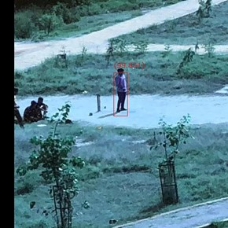

# Pedestrian Dection on Large Arial Images 🚶‍♂️📹

This assignment was a part of placement screening test assigned by NewSpace. This challenge is a part of High Altitude Platform or Pseudo Satellites (HAPS) where an unmanned aerial vehicle (UAV) would be deployed to inspect a region of interest. To make the observation process efficient, a Computer Vision Model can be deployed to highlight the region of interests, send images or alert the base station.


A single high-resolution image is provided where the task is to identify the humans present in the image and create a Bounding Box around them along with a confidence/ probability of that detection.

Since the image is very large with respect to humans present in them and due to the presence of a lot of trees, bushes and building; a simple detection algorithm like HOG (Histograms of Oriented Gradients) would fail to accurately identify the number of people.
Considering the complexity of the problem, I moved towards Deep Learning solutions, YOLOv3 (You Only Look Once) version 3 specifically known around the world for its high accuracy, simplicity and speed.

## About YOLOv3

YOLOv3 is one of the variants of a popular object detection algorithm YOLO (You Only Look Once). The published model can recognize 80 different objects and is very fast and nearly as accurate as Single Shot MultiBox Detectors (SSD). This gives YOLO an edge in fast computational workloads where the inferences are time-critical. Unlike the other popular detection models, YOLO runs through the whole image only once and a lot faster than SSD, its closest equivalent.

For a single frame, it divides the image into a 13×13 grid of cells. The size of these 169 cells varies depending on the size of the input. For a 416×416 input size, the cell size is 32×32. Each cell is then responsible for predicting a number of boxes in the image.

For each bounding box, the network also predicts the confidence that the bounding box actually encloses an object and the probability of the enclosed object being a particular class. Most of these bounding boxes are eliminated because their confidence is low or because they are enclosing the same object as another bounding box with a very high confidence score. This technique is called non-maximum suppression.

## IOU

Intersection over Union is an evaluation metric used to measure the accuracy of an object detector on a particular dataset.

Due to the high number of people present in the provided image, I was unable to manually find the coordinates because of the time constraints. Though I have coded the implementation to calculate the IOU. To prove my understanding of the subject, I have created a small sample calculation for IOU.

```
IOU = Area of Intersection / Area of Union
```




**Ground Truth:** <br>
Initial - 256, 150 <br>
Final - 286, 256

**Detection:** <br>
Initial - 255, 163 <br>
Final - 286, 260

Area of Ground truth = 3180 <br>
Area of Detection = 3007

x1 = max(groundTruth.xIn, detection.xIn) <br>
y1 = max(groundTruth.yIn, detection.yIn) <br>
x2 = min(groundTruth.xFn, detection.xFn) <br>
y2 = min(groundTruth.yFn, detection.yFn) <br>


Area of Intersection = max(0, x2 - x1 + 1) * max(0, y2 - y1 + 1) = **2,914** <br>
Are of Union = (3180+3007)-2914 = **3273**

IOU = 2914/3273 = **0.89**

***~89% Accuracy***

## Running the Solution

Since the model needs heavy computation power to process the large image. I have used an `NC6` VM Instance with 56GB memory to perform the task quickly.

To run the solution on the VM, connect to the VM using VSCode’s `Remote -SSH Extension`.

Use the `private_key.pem` file for the private key and use the command

`ssh -i private_key.pem user@10.535.546.13`

*(Note: User your VM's username@ipaddress)*

## Results

The model produced 64 images with bounding boxes around each person. Even though it missed the persons sitting on the far-left and far-right side of the image (5th row from top), the detections are highly accurate and reliable with no false positives.


After the results, I stitched the 64 images back to produce the final output image.

